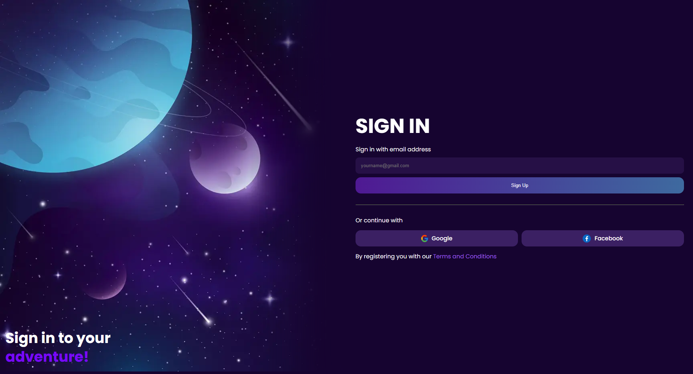

# Sign-In Landing Page

A simple and responsive sign-in landing page built with **HTML** and **CSS**. This project is designed for training purposes only, focusing on layout design and styling.

## 📸 Preview

<a href='https://mustafa-sayed-m.github.io/signin-landing-page/' target='_blank'>
    
</a>

`click on image to go live demo`

## 🖥️ Features
- Fully responsive design 📱💻  
- Clean and minimal UI ✨  
- Google and Facebook sign-in buttons 🔗  
- Organized project structure 📂  

## 📂 Project Structure

    /assets
    ├── css/
    │   ├── main.css
    ├── imgs/
    │   ├── icons/
    │   ├── hero.webp
    index.html

## 🚀 Usage

1. Clone the repository:
   ```sh
   git clone https://github.com/your-username/repo-name.git
   
2. Open index.html in your browser.

# 📜 License

This project is for educational purposes only. You are free to use and modify it.
